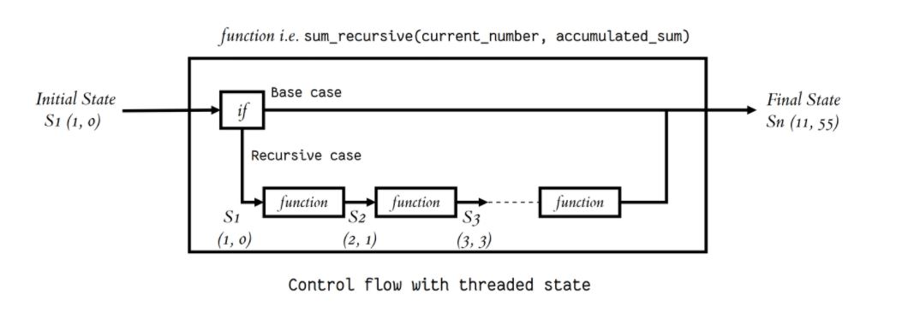

# Reading 3
## Classes and Objects:
* Objects are an encapsulation of variables and functions into a single entity. 
* Objects get their variables and functions from classes. 
* Classes are essentially a template to create your objects.

The author shows different examples to demonstrate how to access objects variable and functions, to run and check go here : https://www.learnpython.org/en/Classes_and_Objects
## Thinking Recursively in Python:
### Dear Pythonic Santa Claus…: 
* The author wants us to use recursion as children
* List of houses=> loops through them=> santa goes to one=> drops a gift=>eats cookies and milk=> moving to the next one : this is iterative algorithm
* The auther then suggested an alogorthim divide the work among two elves 
### Recursive Functions in Python:
* => a recursive function for calculating n! in other words factorial(n): 
    * n! = n x (n−1)! 
    * n! = n x (n−1) x (n−2)!
    * n! = n x (n−1) x (n−2) x (n−3)!
    * ⋅ 
    * ⋅
    * n! = n x (n−1) x (n−2) x (n−3) ⋅⋅⋅⋅ x 3!
    * n! = n x (n−1) x (n−2) x (n−3) ⋅⋅⋅⋅ x 3 x 2!
    * n! = n x (n−1) x (n−2) x (n−3) ⋅⋅⋅⋅ x 3 x 2 x 1!

### Maintaining State:
as per the author: one of those can maintain a state during recursion :
* "Thread the state through each recursive call so that the current state is part of the current call’s execution context"
* "Keep the state in global scope"
  
#### The author gave an example of how  threading state works
 

The author stated that he "prefer threading the state through each recursive call because I find global mutable state to be evil"

### Recursive Data Structures in Python: 
* Using attach_head operation to generate a list.
* Recursive data structures and recursive functions go together like bread and butter.

### Pesky Details: 
* deep recursion can be a problem and can end up in stack overflow after using more stack frames, and can affect your speed and (garbage collection).

## Python Testing with pytest: Fixtures and Coverage
* Two features of pytest the author reviewed:
### Fixtures:
* Def: objects may have data, might have network/filesystem you would share across tests.
* Its a combination of the pytest.fixture decorator as wellas a function defined.
* Using StringIO object to pass it a file-like object, removing "\n"
* The fixture's "scope" is an object than can be used times without creating it everytime
    => @pytest.fixture(scope='module')
### Coverage
* Code coverage: checking your tests gone through all of your code, can be included using: 
    *pytest --cov=drk=> directory you want itsreport
    *coverage html => readable format, open index.html

* To have a 100 % covarge, you can define a test_even_number() function that raises problem. 

